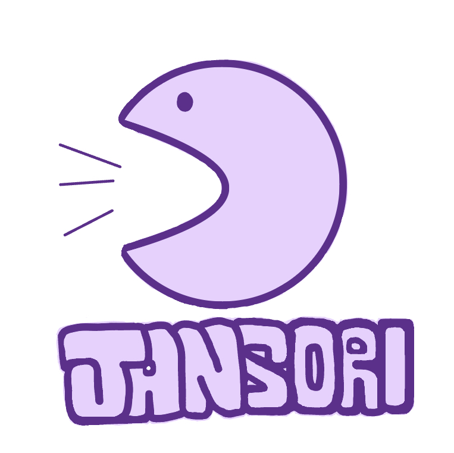
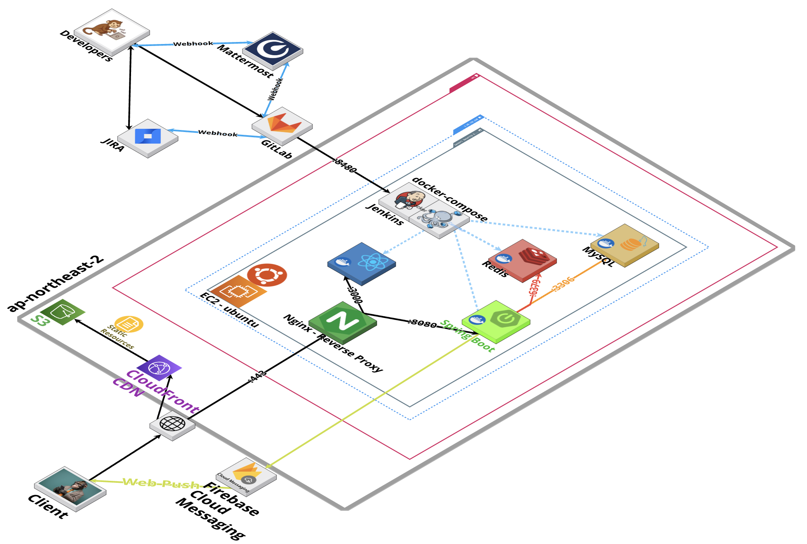
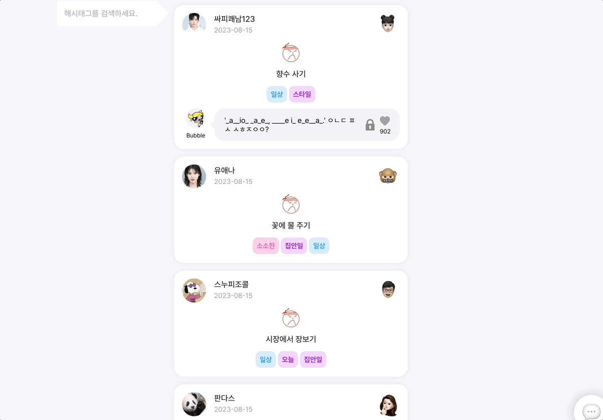
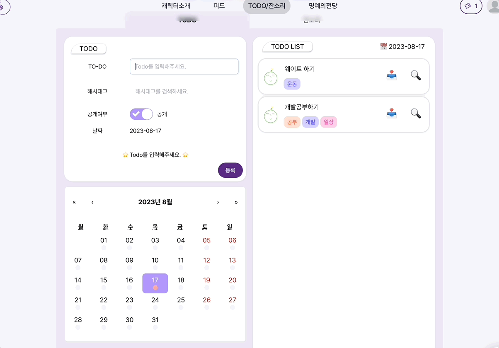
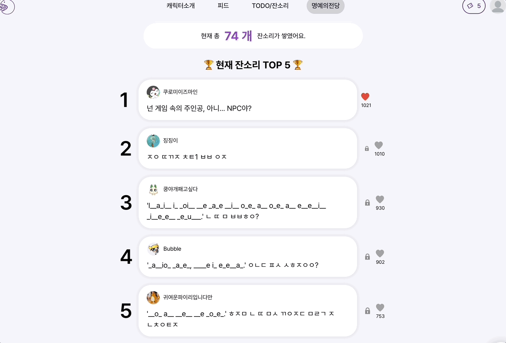

  

<h1 align="middle"><a href="https://github.com/Six-Sibling-Nagging-Barrage/PRODUCE606">JANSORI</a></h1>

6남매의 잔소리 폭격 당해보지 않을래?

## 💬 서비스 소개

`6남매의 잔소리`는 ToDo 성향을 띠고 있는 SNS 서비스이자 누군가에게 잔소리를 하고 나의 Todo에도 잔소리를 들을 수 있는 웹 서비스입니다

## 🙌🏻 멤버

|                                         Backend                                          |                                          Backend                                          |                                          Backend                                          |                                         Backend                                         |                                        Frontend                                         |                                         Frontend                                         |
| :--------------------------------------------------------------------------------------: | :---------------------------------------------------------------------------------------: | :---------------------------------------------------------------------------------------: | :-------------------------------------------------------------------------------------: | :-------------------------------------------------------------------------------------: | :--------------------------------------------------------------------------------------: | 
|  |  |  |  |  |  |
|                      [신현철(팀장)](https://github.com/moonn6pence)                      |                         [배영석](https://github.com/BaeYoungSuk)                          |                         [허성백](https://github.com/sungbaekheo)                          |                          [김태용](https://github.com/YongsHub)                          |                          [좌정현](https://github.com/imhynni)                           |                        [이채정](https://github.com/chaejeong-lee)                        |

  

## 💻 Communication Tool

##    

  

## ⚙️ SKILL STACK

### 🧷 프론트엔드

      

**Language |** Javascript

**Framework |** React 18.2.0

**Engine |** Node 16.20.1

**Library |** Recoil, Tailwind CSS, Styled-Components, Axios, twin.macro

  

### 🧷 백엔드

     

**Language |** Java 11

**Framework |** Spring Boot 2.7

**Data(RDBMS) |** Spring-Data-JPA 2.7.14, MySQL 8.0

**Cache |** Redis 2.7.14

**Build Tool |** Gradle

**Test |** Junit 5.8.2, Mockito 4.5.1

  

### 🧷 인프라

     

**Infra |** AWS EC2, Nginx

**DB |** H2, MySQL 8

**CI/CD |** Git, Jenkins

  

## 🏬 프로젝트 아키텍쳐

### Infrastructure

---

### 🦊 6남매의 잔소리 폭격은 개발자들의 성격을 담은 캐릭터들이 존재합니다!

어떤 성격을 가지고 있는지 궁금하시죠?
`캐릭터 소개를 하나씩 읽어보며 알아가는 재미를 느껴보세요!`
 

캐릭터 알아보기

 
 

### 🐼 Main Feed! 오늘은 어떤 Todo들이 있는지 볼까요?

Todo 들을 무한 스크롤로 볼 수 있으며 태그들을 `검색하고 구독할 수 있습니다!`

메인 피드 알아보기

 
 

### 🐻 Todo에 달린 잔소리는 초성으로 존재합니다!

`티켓을 소모하여 잔소리를 확인해보고 잔소리를 다시 보내서 티켓을 얻을 수 있습니다!`

초성 열고 티켓 얻는법 알아보기

 
 

### 🐒 할일을 생각했는데 까먹으셨나요? 기억하기 위해서는 기록합시다!

`오늘 할일을 태그와 함께 작성하고 도착한 잔소리를 확인해보세요!`

Todo 작성 알아보기

 
 

### 🐸 누가 잔소리를 잘할까? 명예의 잔소리들을 보고 도전해봅시다!

`오늘 할일을 태그와 함께 작성하고 도착한 잔소리를 확인해보세요!`

명예의 전당 알아보기

 
 
